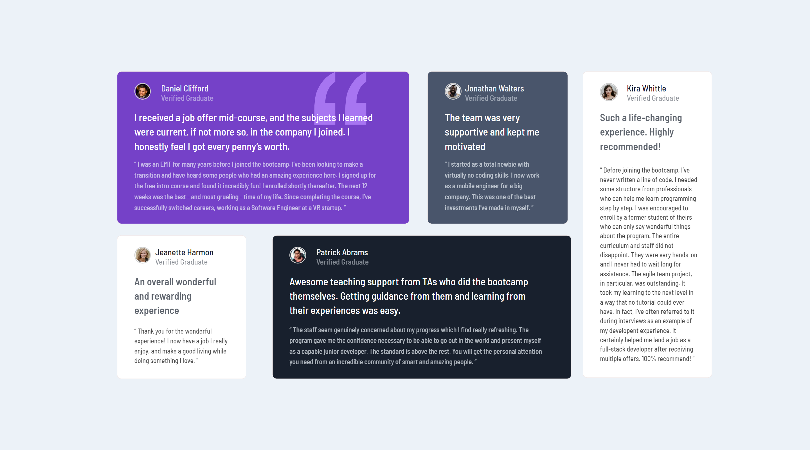

# frontendmentorchallenge

Frontend Mentor - Testimonials grid section solution

This is a solution to the [Testimonials grid section challenge on Frontend Mentor](https://www.frontendmentor.io/challenges/testimonials-grid-section-Nnw6J7Un7). Frontend Mentor challenges help you improve your coding skills by building realistic projects. 

## Table of contents

- [Overview](#overview)
  - [The challenge](#the-challenge)
  - [Screenshot](#screenshot)
  - [Links](#links)
- [My process](#my-process)
  - [Built with](#built-with)
  - [What I learned](#what-i-learned)
  - [Continued development](#continued-development)
- [Author](#author)

## Overview

### The challenge

Users should be able to:

- View the optimal layout for the site depending on their device's screen size

### Screenshot

### Links

- Solution URL: [click me](https://github.com/krtksharma/FrontEndMentorChallenge4-)
- Live Site URL: [click me](https://krtksharma.github.io/FrontEndMentorChallenge4-/)

## My process

### Built with

- Semantic HTML5 markup
- CSS custom properties
- Flexbox
- CSS Grid

### What I learned

With this challenge I came to know more about CSS grid layout.
### Continued development

I want to focus more on grid projects because I am not very much confident in it.

## Author

- Frontend Mentor - [@aruningh009](https://www.frontendmentor.io/profile/krtksharma)
